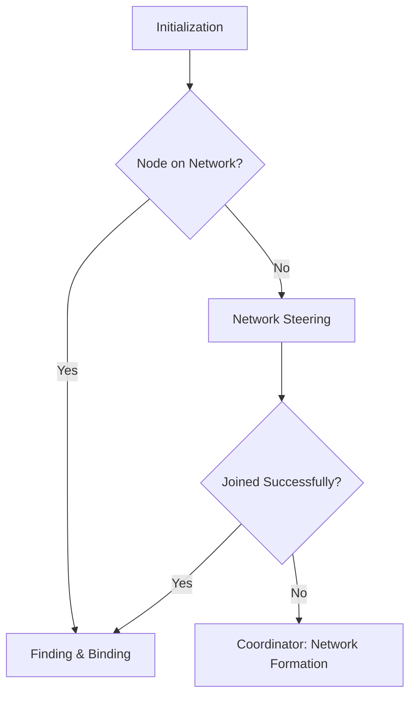

# Zigbee Protocol and Commissioning Guide

This guide explains the architecture of the Zigbee protocol stack, device roles, and the precise step-by-step procedures devices undergo during commissioning (joining a network and linking applications).

---

## 1. The Zigbee Protocol Stack Architecture

The Zigbee protocol stack is built on top of the IEEE 802.15.4 standard and is divided into several layers:

```
+--------------------------------------------------------+
|             Application Layer (APL)                    |
|  +--------------------+  +--------------------------+  |
|  |  Zigbee Cluster    |  |  Zigbee Device Objects   |  |
|  |  Library (ZCL)     |  |  (ZDO)                   |  |
|  +--------------------+  +--------------------------+  |
|  +--------------------------------------------------+  |
|  |       Application Support Sub-layer (APS)        |  |
|  +--------------------------------------------------+  |
+--------------------------------------------------------+
|             Network Layer (NWK)                        |
+--------------------------------------------------------+
|             MAC / PHY Layers (IEEE 802.15.4)           |
+--------------------------------------------------------+
```

### The Application Layer Sub-components:
*   **ZCL (Zigbee Cluster Library):** Defines the standard data attributes and commands (e.g. On/Off, Temperature Measurement).
*   **ZDO (Zigbee Device Objects):** Manages device roles, network discovery, binding requests, and security keys.
*   **APS (Application Support Sub-layer):** Routes data between endpoints on different nodes, filters duplicate packets, and manages binding tables.

---

## 2. Zigbee Device Roles

Every Zigbee network contains exactly one Coordinator and any number of Routers and End Devices.

| Role | Device Type | Functions | Power Mode |
| :--- | :--- | :--- | :--- |
| **Coordinator (ZC)** | Trust Center | Starts the network, selects channels, distributes security keys, and routes packets. | Always-On |
| **Router (ZR)** | Range Extender | Routes packets, maintains routing tables, and allows other devices to join through it. | Always-On |
| **End Device (ZED)** | Leaf Node | Communicates only with its parent (Coordinator/Router). Does not route traffic. | Low-Power (Sleepy) |

---

## 3. BDB Commissioning Procedure (Step-by-Step)

The **Base Device Behavior (BDB)** specification defines a standard state machine for device installation and network association.



### Step 1: Initialization
Upon boot, the device checks its non-volatile memory (NVRAM). 
*   If network credentials exist, it attempts to reconnect (rejoin).
*   If no credentials exist (or after a factory reset), it enters the commissioning state.

### Step 2: Network Formation (Coordinator Only)
The Coordinator establishes the network:
1.  **Energy Detection (ED) Scan:** The Coordinator scans available channels in the 2.4 GHz spectrum to measure noise levels.
2.  **Active Scan:** It scans to ensure no existing network uses the same PAN ID.
3.  **Startup:** It selects the cleanest channel, chooses a random 16-bit PAN ID and 64-bit Extended PAN ID, and begins broadcasting beacons.

### Step 3: Network Steering (End Device / Router Joining)
Network steering allows a node to find and join an active network:
1.  **Scanning:** The joining device performs an Active Scan, broadcasting **Beacon Requests** on all supported channels.
2.  **Beacons:** Any Coordinator or Router on the channel that has its **Permit Join** window open responds with a **Beacon** frame containing its PAN ID and joining availability.
3.  **Parent Selection:** The device selects the parent with the strongest link quality (RSSI) and starts the association handshake.

---

## 4. Over-The-Air (OTA) Steering Handshake

When a device connects to a parent node, the following MAC-level and network-level exchanges occur:

```
Joining Device                                             Parent Node (ZC/ZR)
      |                                                             |
      |------------------ Beacon Request (Broadcast) -------------->|
      |<----------------- Beacon (Permit Join = True) --------------|
      |                                                             |
      |------------------ Association Request --------------------->|
      |<----------------- Association Response (Assigns Short Addr) -|
      |                                                             |
      |   [Security Phase: Encrypted with Default Link Key]         |
      |<----------------- Transport Key (Sends Network Key) --------|
      |                                                             |
      |------------------ Device Announce (Broadcast) ------------->|
```

1.  **Association Request:** The joining device requests connection, supplying its 64-bit IEEE MAC Address and device capabilities.
2.  **Association Response:** The parent accepts the device, assigning it a 16-bit Network Short Address (e.g. `0x12A4`).
3.  **Transport Key (Security):** The Coordinator (Trust Center) encrypts the **Active Network Key** using the standard pre-configured **Trust Center Link Key** (`ZigBeeAlliance09`) and transmits it to the joining device. All subsequent network communications are encrypted using this Network Key.
4.  **Device Announce:** The new device broadcasts a `Device Announce` message containing its MAC address, short address, and capabilities so that other routers update their routing tables.

---

## 5. Finding and Binding (Application Linkage)

Once devices share a network, they need to know *what* endpoint commands to send to *whom*. This is managed by **Finding and Binding**:

1.  **Target Identifies:** The target device (e.g. a Light Bulb running a Server cluster) is put into **Identify Mode** (usually by setting the `identify_time` attribute > 0).
2.  **Match Descriptor Request:** The initiator device (e.g. a Switch running a Client cluster) sends a broadcast `Match Descriptor Request` searching for endpoints that match its outgoing profile (e.g. Home Automation) and Cluster ID (e.g. `On/Off`).
3.  **Match Descriptor Response:** The target responds with its short address and matching endpoint ID.
4.  **Binding Table Entry:** The initiator creates a **Binding** entry in its internal flash memory. From now on, when you press a button on the switch, the APS layer automatically maps the command to the target's short address and endpoint.
