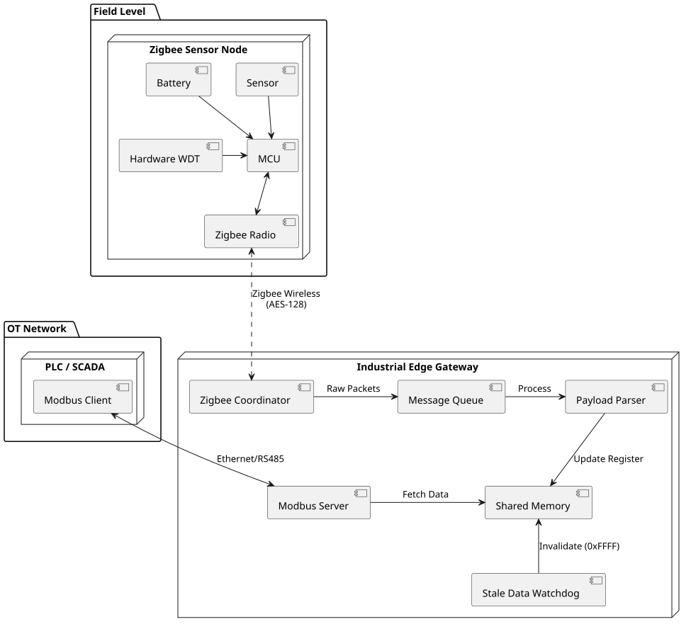
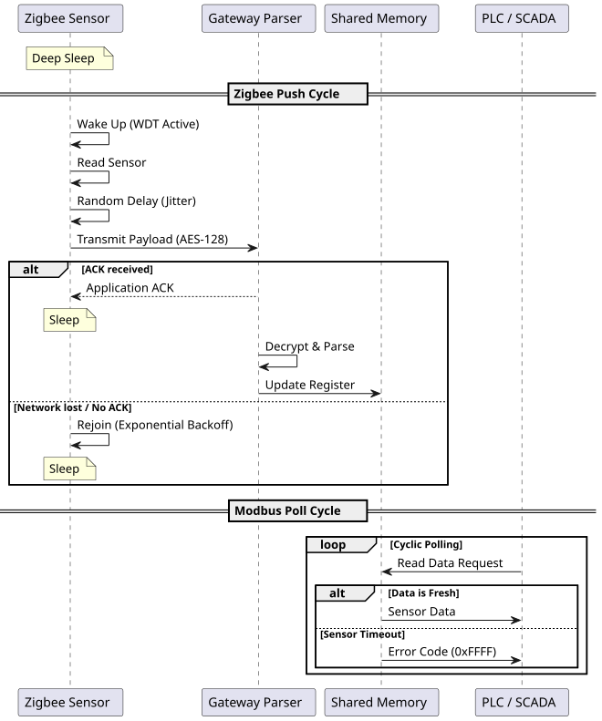

[](https://github.com/George-IRR/ZigBee-Gateway_nRF52840-DK/actions/workflows/zephyr_unit_tests.yml)
# Work Plan: Zigbee-Modbus Gateway

## 1. Architecture and Requirements

The system acts as a bridge between a wireless Zigbee sensor network and a control system via Modbus.

* **End Device:** Battery-powered temperature sensor. Operates primarily in **Deep Sleep** mode and utilizes a **Hardware Watchdog Timer (WDT)** for recovery from hangs. It wakes up at regular intervals, applies a random delay (**Jitter**) to avoid RF collisions, and transmits an encrypted payload (**AES-128**). In case of ACK failure, it applies an **Exponential Backoff Rejoin** algorithm.
* **Gateway:** Asynchronously captures packets from the Zigbee network, decrypts them, and extracts useful information. Data is stored in **Shared Memory (Register Map)**. A **Stale Data Watchdog** monitors the time since the last reception; if a limit is exceeded, it overwrites the register with `0xFFFF` to invalidate old data.
* **Modbus Interface:** The Gateway runs a **Modbus TCP/RTU Server** that allows polling by an external client (SCADA/PLC) of the registers stored in the shared memory.
* **CI/CD:** Development includes an automated pipeline for building and unit testing, focusing on validating parsing logic, concurrent register access, and timeout triggers.

## 2. Diagrams

### 2.1 Data Flow



### 2.2 System Topology



## 3. Development Steps

### Phase 1: Setup & CI/CD
* [x] Select Gateway and End-device hardware.
* [x] Configure basic **GitHub Actions** CI/CD pipeline.
* [x] Integrate linter and **Unit Testing** framework.

### Phase 2: End-Device (Zigbee Node)
* [x] Interface sensors with the microcontroller. (BMP180 Integrated)
* [ ] Implement **Hardware WDT** and **Deep Sleep / Wake Up** routines.
* [ ] Establish Zigbee network connection with **AES-128** encryption and define payload format.
* [ ] Implement cyclic transmission with pre-transmission **Jitter** and **Exponential Backoff** for lost ACKs.

### Phase 3: Gateway & Parser
* [x] Configure Gateway as a **Zigbee Coordinator**.
* [ ] Implement a **Message Queue** for asynchronous message handling.
* [ ] Develop the payload parser and write Unit Tests in the CI/CD pipeline to validate decoding.

### Phase 4: Modbus Server & Shared Memory
* [ ] Implement **Shared Memory** with concurrent access protection (**mutex**).
* [ ] Implement the **Stale Data Watchdog** for invalidating un-updated values.
* [ ] Set up the Modbus server on the designated port.
* [ ] Integrate automated logic tests for the flow: *Memory Write -> Timeout Trigger -> Modbus Response Validation*.

### Phase 5: E2E Integration (End-to-End)
* [x] Full hardware/software system execution. (E2E Zigbee communication tested)
* [ ] Test register polling using an external Modbus client.

---

## 4. Testing and Flashing Guide

For in-depth explanations and strategies, refer to the [Testing Strategy and Execution Guide](Docs/testing_guide.md).

### 4.1 Global Project Configuration (`config.env`)
The repository contains a global configuration file [config.env](config.env) at the root level. **Before building, flashing, or testing, you must edit this file** to set your J-Link target serial numbers and SDK toolchain paths:
```env
# Hardware Device IDs (nRF52840-DK J-Link Serial Numbers)
SWITCH_DEV_ID=xxxxxxxxxx
COORD_DEV_ID=xxxxxxxxxx

# Path to the nRF Connect SDK Toolchain installation directory
NCS_TOOLCHAIN_DIR=/home/xxxxx/ncs/toolchains/b77d8c1312
```

### 4.2 Environment Preparation
Export the toolchain paths using the settings defined in your `config.env`:
```bash
# Load variables from config.env
source config.env

# Export variables
export PATH="$NCS_TOOLCHAIN_DIR/bin:$NCS_TOOLCHAIN_DIR/usr/bin:$NCS_TOOLCHAIN_DIR/usr/local/bin:$NCS_TOOLCHAIN_DIR/opt/bin:$NCS_TOOLCHAIN_DIR/opt/nanopb/generator-bin:$NCS_TOOLCHAIN_DIR/opt/zephyr-sdk/arm-zephyr-eabi/bin:$NCS_TOOLCHAIN_DIR/opt/zephyr-sdk/riscv64-zephyr-elf/bin:$PATH"
export LD_LIBRARY_PATH="$NCS_TOOLCHAIN_DIR/lib:$NCS_TOOLCHAIN_DIR/lib/x86_64-linux-gnu:$NCS_TOOLCHAIN_DIR/usr/local/lib:$LD_LIBRARY_PATH"
export ZEPHYR_TOOLCHAIN_VARIANT="zephyr"
export ZEPHYR_SDK_INSTALL_DIR="$NCS_TOOLCHAIN_DIR/opt/zephyr-sdk"
```

### 4.3 Flashing Devices

> [!WARNING]
> On modern NCS setups or machines without SEGGER's command-line tools, `nrfjprog` is deprecated or missing.
> To use `nrfutil` as the runner instead, you must add the following line to your project's `CMakeLists.txt` before loading Zephyr:
> ```cmake
> set(BOARD_FLASH_RUNNER nrfutil)
> ```

#### Option A: Using the flash script
Run the helper script which automatically loads `config.env` and flashes the target devices using `nrfutil`:
```bash
# Flash the End Device
./flash_devices.sh switch

# Flash the Network Coordinator
./flash_devices.sh coord

# Flash both in parallel
./flash_devices.sh all
```

#### Option B: Flashing manually (without script)
To flash manually without the script, make sure you are in the top-level directory of your west workspace (e.g., `~/ncs/v2.9.2`) and load `config.env` first:
```bash
source <path_to_repo>/config.env

# Flash End Device
west flash -d <path_to_end_device>/build --dev-id $SWITCH_DEV_ID --runner nrfutil

# Flash Coordinator
west flash -d <path_to_coordinator>/build --domain network_coordinator --dev-id $COORD_DEV_ID --runner nrfutil
```

### 4.4 Running Tests

We have implemented three levels of testing for the BMP180 Zigbee application:

#### 1. Unit Tests (PC - No Hardware)
Exercises the BMP180 temperature compensation formula logic and edge cases on your host PC via emulation (`native_sim` / `unit_testing` board):
```bash
west twister -T zigbee_end_device/bmp180_device/tests/unit/ --inline-logs
```

#### 2. Integration Tests (nRF52840-DK + BMP180 Sensor)
Validates physical driver initializations and raw I2C transactions on the physical target board:
```bash
west twister -T zigbee_end_device/bmp180_device/tests/integration/ \
             -p nrf52840dk/nrf52840 \
             --device-testing \
             --device-serial /dev/ttyACM0 \
             --device-serial-baud 115200 \
             --west-flash \
             --west-runner nrfutil
```

#### 3. End-to-End Tests (Zigbee Network - Dual Hardware)
Validates that the mocked temperature values sent by the End Device over Zigbee are received and logged by the Network Coordinator. The PC acts as the middleman monitoring both serial UART channels:
```bash
source config.env
west twister -T zigbee_end_device/bmp180_device/tests/e2e/ \
             -p nrf52840dk/nrf52840 \
             --device-testing \
             --device-serial /dev/ttyACM0 \
             --device-serial-baud 115200 \
             --west-flash="--dev-id=$SWITCH_DEV_ID" \
             --west-runner nrfutil \
             --inline-logs
```
